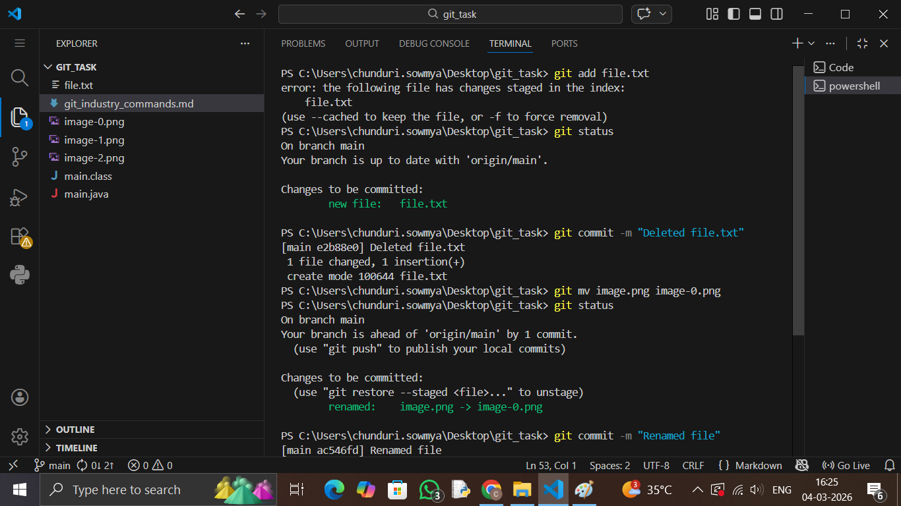
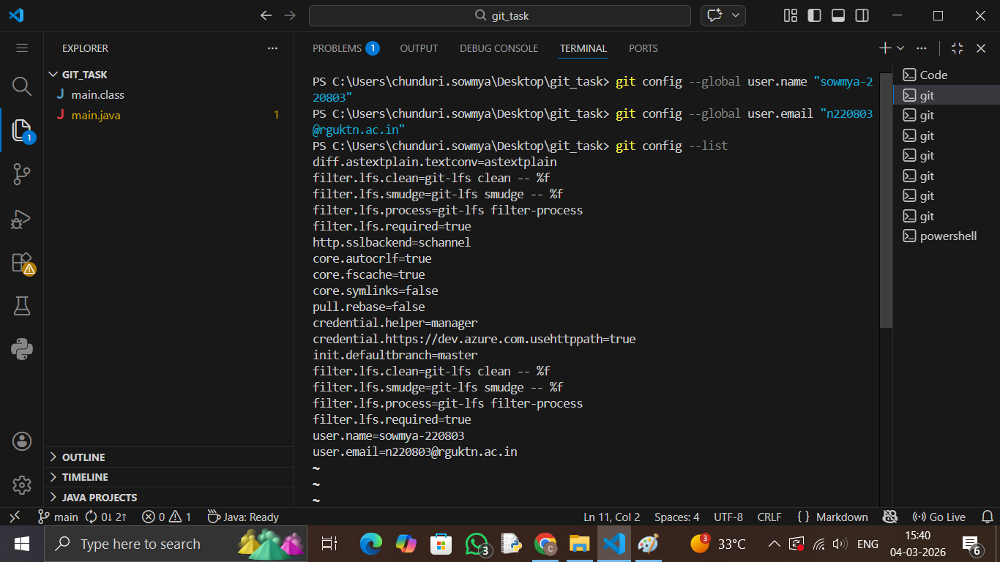
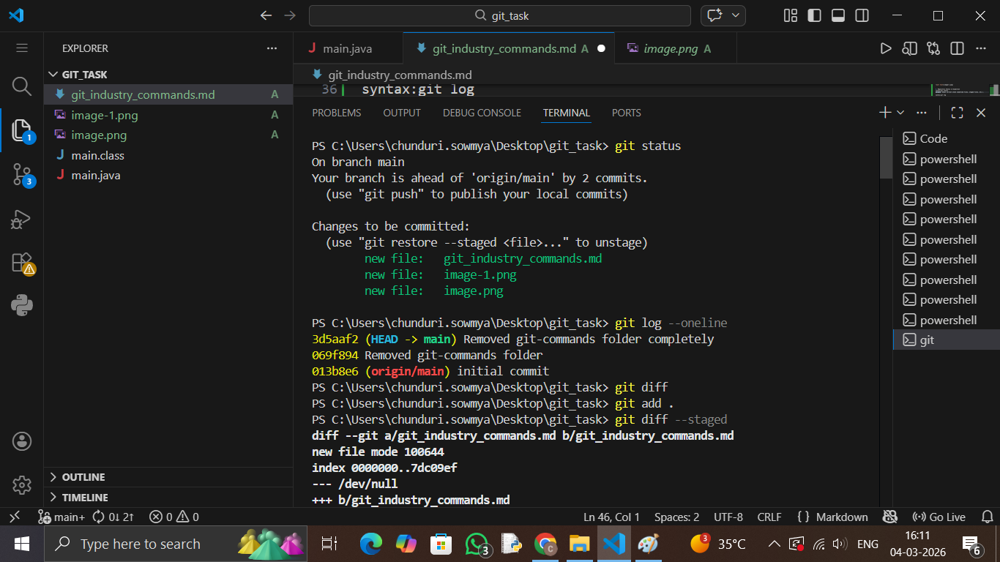
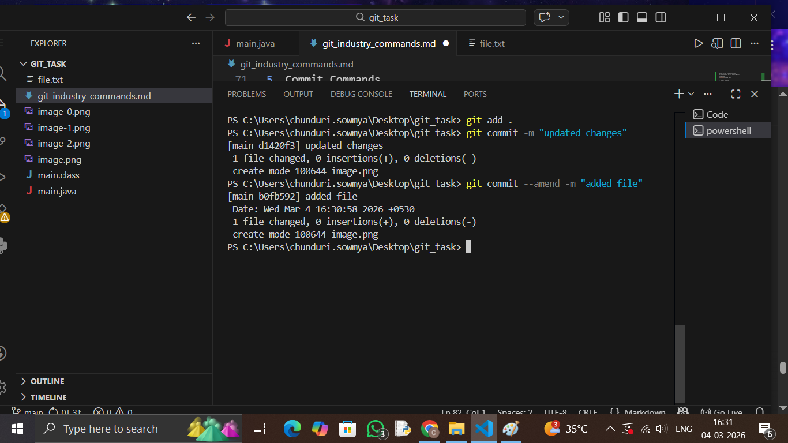
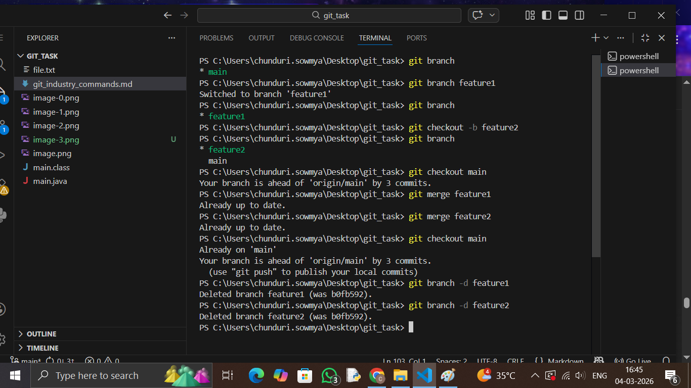
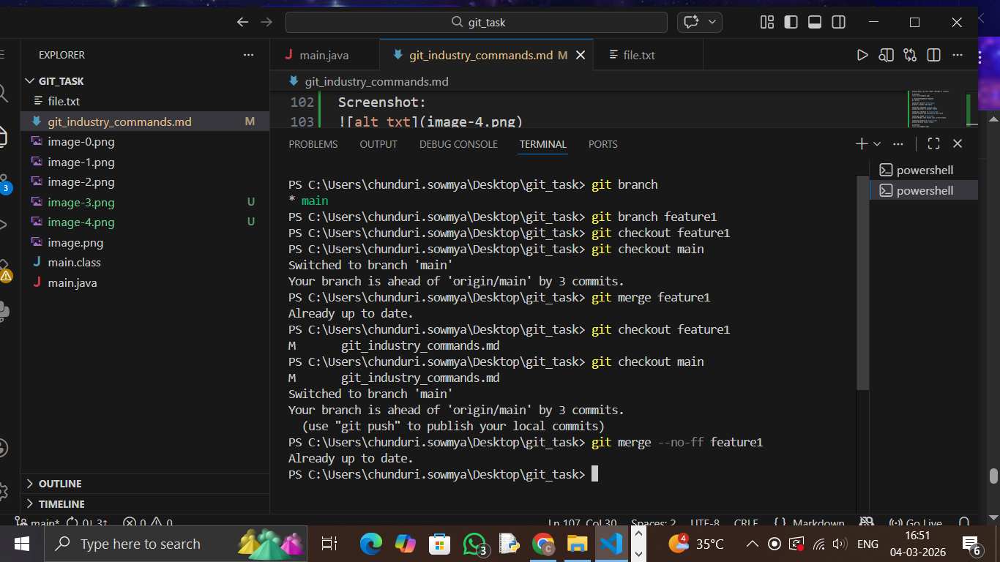
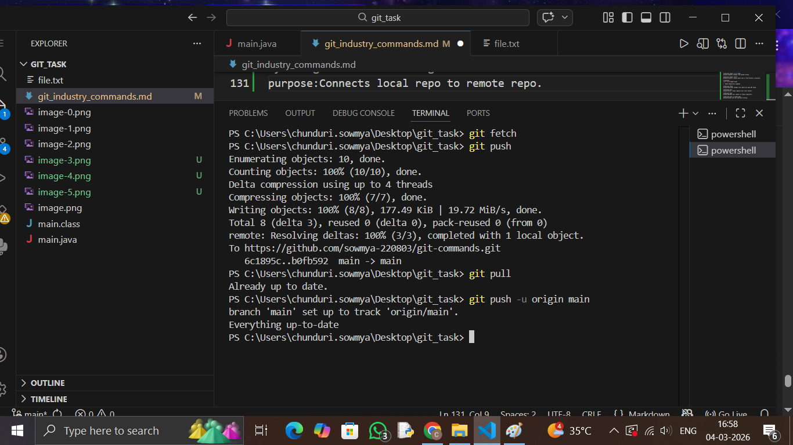
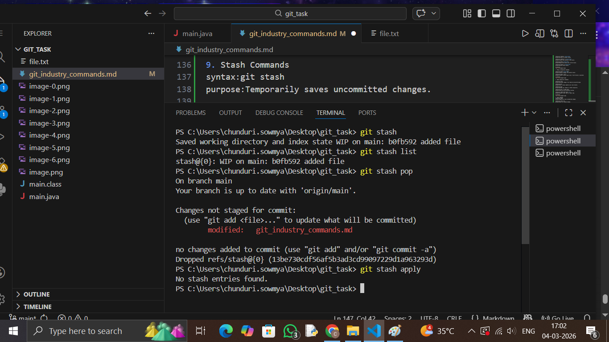
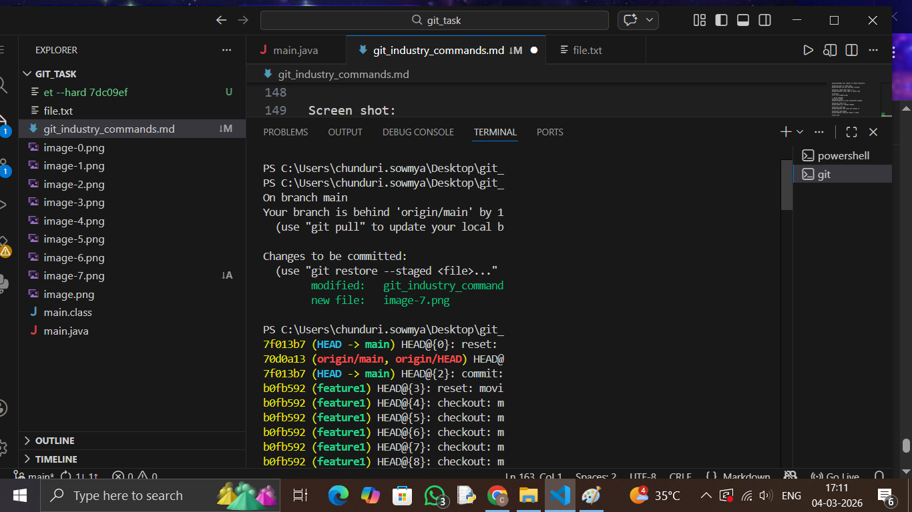
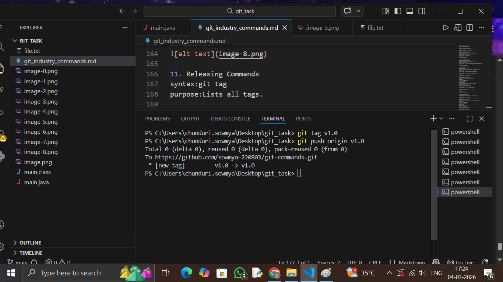

git configuration commands:

Syntax: git config --global user.name "Your Name"
Purpose:Sets your Git username (used in commits).

Synatx:git config --global user.email "your@email.com"
purpose: Sets your email (used in commits).

Syntax:git config --list
purpose:Shows all current Git configuration settings.
  
  ScreenShot:
  

2. Repository Setup Commands
Synatx:git init
purpose:Initializes a new Git repository in the folder.

Syntax:git clone <repo-url>
Purpose:Copies an existing remote repository to your local system.

Syntax:git remote
Purpose:Shows connected remote repositories.

Syntax:git remote -v
purpose:Shows remote repositories with URLs (fetch & push links). 

Screenshot:

3. Repository Status & Inspection
syntax:git status
purpose: Shows current state (modified files, staged files, etc.).

syntax:git log
purpose:Shows commit history.

synatax:git log --oneline
purpose:Shows commit history in short format.

syntax:git show
purpose:Shows detailed information about a specific commit.

syntax:git diff
purpose:Shows changes between working directory and last commit.

 Screenshot:
 

4. File Tracking Commands

Syntax:git add <file>
purpose: Adds file to staging area.

Syntax:git add .
purpose: Adds all modified files to staging.

Syntax:git reset <file>
purpose:Removes file from staging area.

Syntax:git rm <file>
purpose:Deletes file and stages the deletion.

syntax:git mv oldname newname
purpose:Renames a file and stages it.

Screenshot:

5. Commit Commands
syntax:git commit
purpose:Saves staged changes to repository.

syntax:git commit -m "message"
purpose:Commits with a message directly.

syntax:git commit --amend
purpose:Edits the last commit (message or content).

Screenshot:

6. Branch Management Commands
git branch

syntax:git branch <branch-name>
purpose: Creates new branch.

syntax:git checkout <branch-name>
purpose:Switches to another branch.

syntax:git checkout -b <branch-name>
purpose:Creates and switches to new branch.

syntax:git merge <branch-name>
purpose:Merges that branch into current branch.

syntax:git branch -d <branch-name>
purpose:Deletes branch safely.

Screenshot:

7. Merge & Integration Commands

syntax:git merge <branch name>
purpose:Combines changes from another branch.

syntax:git merge --no-ff
purpose:Creates a merge commit even if fast-forward is possible.

screenshot:

8. Remote Repository Commands

syntax:git fetch
purpose:Downloads changes from remote but does NOT merge.

syntax:git pull
purpose:Fetch + merge (updates your local branch).

syntax:git push
purpose:Uploads your commits to remote repository.

syntax:git push -u origin main
purpose:Pushes and sets upstream tracking.

syntax:git remote add origin <url>
purpose:Connects local repo to remote repo.

Screenshot:

9. Stash Commands
syntax:git stash
purpose:Temporarily saves uncommitted changes.

synatx:git stash list
purpose:Shows all stashed changes.

syntax:git stash pop
purpose:Applies last stash and removes it.

syntax:git stash apply
purpose:Applies stash but keeps it saved.

Screen shot:

10. Reset & Undo Commands
syntax:git reset --soft HEAD~1
purpose: Undo last commit but keep changes staged.

syntax:git reset --hard HEAD~1
purpose:Completely remove last commit and changes.

syntax:git revert <commit-id>
purpose:Creates new commit that reverses previous commit.

Screenshot:

11. Releasing Commands
syntax:git tag
purpose:Lists all tags.

syntax:git tag v1.0
purpose: Creates version tag.

syntax:git push origin v1.0
purpose:Pushes tag to GitHub.

Screen shot:

12. Cherry Pick & Patch

syntax:git cherry-pick <commit-id>
purpose: Applies specific commit from another branch.

syntax:git apply <file.patch>
purpose:Applies a patch file.

screenshot: